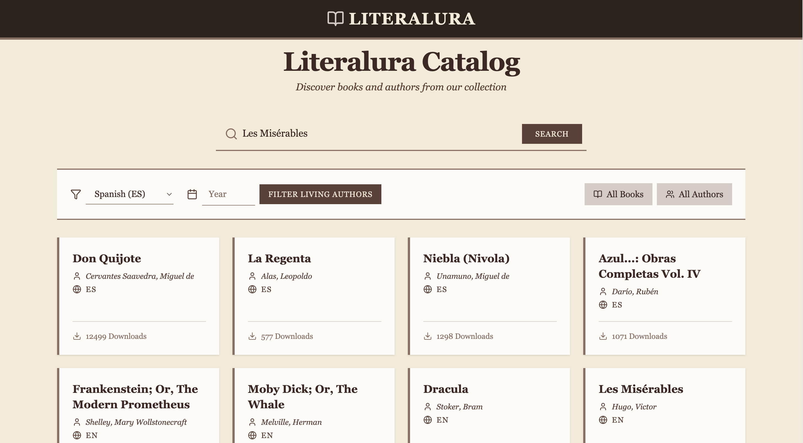

# Literalura - Book Catalog



**Literalura** is a Single Page Application (SPA) designed as a digital book catalog with a vintage, classic aesthetic. It allows users to search for books, explore authors, and filter content based on languages or historical periods.

This project was built as a frontend challenge, consuming a Spring Boot backend API.

## Features

*   **Search Books:** Find books by title using the hero search bar.
*   **Filter by Language:** Browse books available in Spanish (ES), English (EN), French (FR), and Portuguese (PT).
*   **Living Authors:** Discover authors who were alive during a specific year.
*   **Catalog Views:** Switch easily between viewing the grid of Books and the list of Authors.
*   **Responsive Design:** A fully responsive interface that adapts gracefully from desktop to mobile devices.
*   **Vintage UI:** A custom design system featuring serif typography, paper-like colors, and sharp edges to evoke the feeling of classic literature.

## 🛠️ Tech Stack

*   **Framework:** [React](https://react.dev/) (via [Vite](https://vitejs.dev/))
*   **Styling:** [Tailwind CSS v4](https://tailwindcss.com/)
*   **HTTP Client:** [Axios](https://axios-http.com/)
*   **Icons:** [Lucide React](https://lucide.dev/)
*   **Architecture:** Feature-based folder structure.

## Getting Started

### Prerequisites

*   Node.js (v18 or higher recommended)
*   The Literalura Backend (Spring Boot) running on `http://localhost:8080`

### Installation

1.  Clone the repository:
    ```bash
    git clone https://github.com/your-username/literalura-front.git
    cd literalura-front
    ```

2.  Install dependencies:
    ```bash
    npm install
    ```

3.  Run the development server:
    ```bash
    npm run dev
    ```

4.  Open your browser at `http://localhost:5173`.

## 📂 Project Structure

The project follows a scalable **feature-based architecture**:

```
src/
├── features/
│   └── books/
│       ├── components/   # UI components specific to books (BookCard, SearchBar, etc.)
│       ├── hooks/        # Custom hooks (useBooks, useAuthors)
│       └── services/     # API integration (apiService.js)
├── shared/
│   └── components/       # Reusable components (Navbar, Layout, Loader)
├── App.jsx               # Main application component
└── main.jsx              # Entry point
```

## API Integration

The application consumes the following endpoints from the backend:

*   `GET /libros/{titulo}` - Search and save a book.
*   `GET /libros` - List all registered books.
*   `GET /libros/idioma/{code}` - Filter books by language code.
*   `GET /libros/autores` - List all registered authors.
*   `GET /libros/autores-vivos/{year}` - List authors alive in a given year.

## Design

The design focuses on a **"Vintage/Classic"** theme:
*   **Colors:** Cream backgrounds (`#f4ecd8`), Dark Brown text (`#2c241b`), and Earthy accents (`#8d6e63`).
*   **Typography:** Serif fonts for headings and body text.
*   **Layout:** Clean grids with sharp edges (no rounded corners) to mimic physical book cards.

---

*Developed by Fabian1803*
